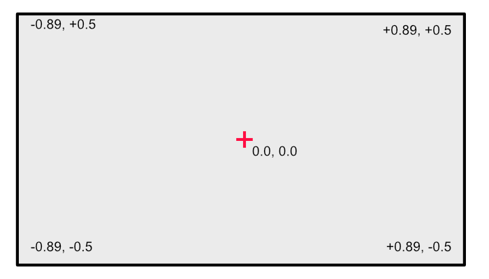

# Coordinate systems

PsychoJL has several diferent coordinate systems available.
 * LT_Pix *left top in pixels*
 * LT_Percent *left top in percent of height*
 * LB_Percent *left bottom in percent of height*
 * PsychoPy *Psychopy-style height units*
---
 ## LT_Pix

 The origin is in the left-top corner, positive y-values go downward, and the units of measure are pixels.
 The size of the dimensions are determined by the size of your window.  All units are in integers (Int64).

 ### Note on fullscreen mode

 If you set the draw area of your window to less than the full screen size, then draws in full-screen mode will be truncated to the 
 dimensions of the window you made. This can be confusing, as the screen can appear all black, but drawing is limited to the
 subsection of the screen you specified.

---
  ## LT_Percent

 The origin is in the left-top corner, positive y-values go downward, and the units of measure are percentage of the height.
 The height dimension always ranges from 0.0 to 1.0, but width varies depending on the aspect ratio of the window.
 In the example below, the aspect ratio is 1.7778:1 (2560 x 1440).
 All units are floating point (Float64).

 

 ---
  ## LB_Percent

 The origin is in the left-bottom corner, positive y-values go upward, and the units of measure are percentage of the height.
 The height dimension always ranges from 0.0 to 1.0, but width varies depending on the aspect ratio of the window.
 In the example below, the aspect ratio is 1.7778:1 (2560 x 1440).
 All units are floating point (Float64).

 
 
 ---
  ## [Psychopy](@id PsychoPyCoordinates)

 The origin is in the middle of the screen, positive y-values go upward, and the units of measure are percentage of the height.
 The height dimension always ranges from -0.5 to +0.5, but width varies depending on the aspect ratio of the window.
 In the example below, the aspect ratio is 1.7778:1 (2560 x 1440).
 All units are floating point (Float64).

 
 
